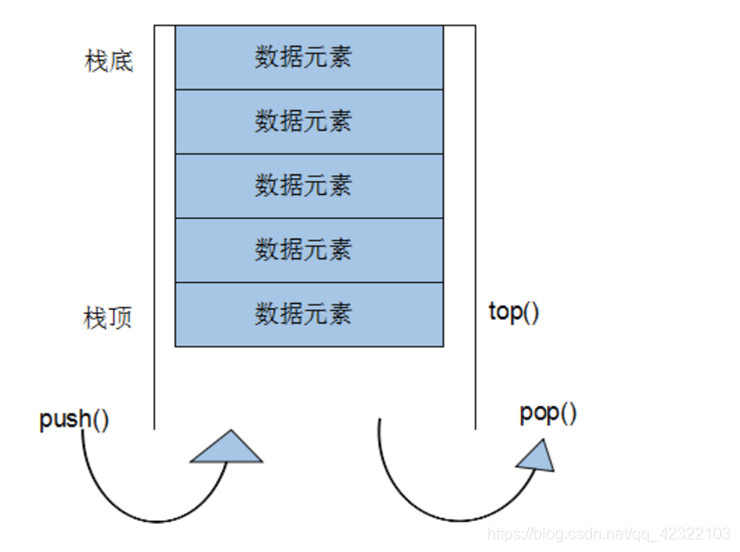

# [STL](https://blog.csdn.net/qq_42322103/article/details/99685797?ops_request_misc=%257B%2522request%255Fid%2522%253A%2522166625307516782414972127%2522%252C%2522scm%2522%253A%252220140713.130102334..%2522%257D&request_id=166625307516782414972127&biz_id=0&utm_medium=distribute.pc_search_result.none-task-blog-2~all~top_positive~default-1-99685797-null-null.142^v59^control,201^v3^add_ask&utm_term=STL&spm=1018.2226.3001.4187)

# Vectors （向量）


```c++
//vector构造函数
vector<T> v; //采用模板实现类实现，默认构造函数
vector(v.begin(), v.end());//将v[begin(), end())区间中的元素拷贝给本身。
vector(n, elem);//构造函数将n个elem拷贝给本身。
vector(const vector &vec);//拷贝构造函数。

//例子 使用第二个构造函数 我们可以...
int arr[] = {2,3,4,1,9};
vector<int> v1(arr, arr + sizeof(arr) / sizeof(int)); 

//常用赋值操作
assign(beg, end);//将[beg, end)区间中的数据拷贝赋值给本身。
assign(n, elem);//将n个elem拷贝赋值给本身。
vector& operator=(const vector  &vec);//重载等号操作符
swap(vec);// 将vec与本身的元素互换。

//大小操作
size();//返回容器中元素的个数
empty();//判断容器是否为空
resize(int num);//重新指定容器的长度为num，若容器变长，则以默认值填充新位置。如果容器变短，则末尾超出容器长度的元素被删除。
resize(int num, elem);//重新指定容器的长度为num，若容器变长，则以elem值填充新位置。如果容器变短，则末尾超出容器长>度的元素被删除。
capacity();//容器的容量
reserve(int len);//容器预留len个元素长度，预留位置不初始化，元素不可访问。

//数据存取操作
at(int idx); //返回索引idx所指的数据，如果idx越界，抛出out_of_range异常。
operator[];//返回索引idx所指的数据，越界时，运行直接报错
front();//返回容器中第一个数据元素
back();//返回容器中最后一个数据元素

//插入和删除操作
insert(const_iterator pos, int count,ele);//迭代器指向位置pos插入count个元素ele.
push_back(ele); //尾部插入元素ele
pop_back();//删除最后一个元素
erase(const_iterator start, const_iterator end);//删除迭代器从start到end之间的元素
erase(const_iterator pos);//删除迭代器指向的元素
clear();//删除容器中所有元素
```


# deque容器


```c++
//构造函数
deque<T> deqT;//默认构造形式
deque(beg, end);//构造函数将[beg, end)区间中的元素拷贝给本身。
deque(n, elem);//构造函数将n个elem拷贝给本身。
deque(const deque &deq);//拷贝构造函数。

//赋值操作
assign(beg, end);//将[beg, end)区间中的数据拷贝赋值给本身。
assign(n, elem);//将n个elem拷贝赋值给本身。
deque& operator=(const deque &deq); //重载等号操作符 
swap(deq);// 将deq与本身的元素互换

//deque大小操作
deque.size();//返回容器中元素的个数
deque.empty();//判断容器是否为空
deque.resize(num);//重新指定容器的长度为num,若容器变长，则以默认值填充新位置。如果容器变短，则末尾超出容器长度的元素被删除。
deque.resize(num, elem); //重新指定容器的长度为num,若容器变长，则以elem值填充新位置,如果容器变短，则末尾超出容器长度的元素被删除。

//deque双端插入和删除操作

push_back(elem);//在容器尾部添加一个数据
push_front(elem);//在容器头部插入一个数据
pop_back();//删除容器最后一个数据
pop_front();//删除容器第一个数据

//deque数据存取

at(idx);//返回索引idx所指的数据，如果idx越界，抛出out_of_range。
operator[];//返回索引idx所指的数据，如果idx越界，不抛出异常，直接出错。
front();//返回第一个数据。
back();//返回最后一个数据

//deque插入操作

insert(pos,elem);//在pos位置插入一个elem元素的拷贝，返回新数据的位置。
insert(pos,n,elem);//在pos位置插入n个elem数据，无返回值。
insert(pos,beg,end);//在pos位置插入[beg,end)区间的数据，无返回值。

//deque删除操作

clear();//移除容器的所有数据
erase(beg,end);//删除[beg,end)区间的数据，返回下一个数据的位置。
erase(pos);//删除pos位置的数据，返回下一个数据的位置

```

# stack容器



```c++
stack构造函数

stack<T> stkT;//stack采用模板类实现， stack对象的默认构造形式： 
stack(const stack &stk);//拷贝构造函数

stack赋值操作

stack& operator=(const stack &stk);//重载等号操作符

stack数据存取操作

push(elem);//向栈顶添加元素
pop();//从栈顶移除第一个元素
top();//返回栈顶元素

stack大小操作
empty();//判断堆栈是否为空
size();//返回堆栈的大小
```

# queue容器


```c++
queue构造函数

queue<T> queT;//queue采用模板类实现，queue对象的默认构造形式：
queue(const queue &que);//拷贝构造函数
1
2
queue存取、插入和删除操作

push(elem);//往队尾添加元素
pop();//从队头移除第一个元素
back();//返回最后一个元素
front();//返回第一个元素
1
2
3
4
queue赋值操作

queue& operator=(const queue &que);//重载等号操作符
1
queue大小操作

empty();//判断队列是否为空
size();//返回队列的大小
————————————————
版权声明：本文为CSDN博主「沉晓」的原创文章，遵循CC 4.0 BY-SA版权协议，转载请附上原文出处链接及本声明。
原文链接：https://blog.csdn.net/qq_42322103/article/details/99685797
```

# list容器


```c++
list构造函数

list<T> lstT;//list采用采用模板类实现,对象的默认构造形式：
list(beg,end);//构造函数将[beg, end)区间中的元素拷贝给本身。
list(n,elem);//构造函数将n个elem拷贝给本身。
list(const list &lst);//拷贝构造函数。

list数据元素插入和删除操作
push_back(elem);//在容器尾部加入一个元素
pop_back();//删除容器中最后一个元素
push_front(elem);//在容器开头插入一个元素
pop_front();//从容器开头移除第一个元素
insert(pos,elem);//在pos位置插elem元素的拷贝，返回新数据的位置。
insert(pos,n,elem);//在pos位置插入n个elem数据，无返回值。
insert(pos,beg,end);//在pos位置插入[beg,end)区间的数据，无返回值。
clear();//移除容器的所有数据
erase(beg,end);//删除[beg,end)区间的数据，返回下一个数据的位置。
erase(pos);//删除pos位置的数据，返回下一个数据的位置。
remove(elem);//删除容器中所有与elem值匹配的元素。

list大小操作
size();//返回容器中元素的个数
empty();//判断容器是否为空
resize(num);//重新指定容器的长度为num，
若容器变长，则以默认值填充新位置。
如果容器变短，则末尾超出容器长度的元素被删除。
resize(num, elem);//重新指定容器的长度为num，
若容器变长，则以elem值填充新位置。
如果容器变短，则末尾超出容器长度的元素被删除。

list赋值操作
assign(beg, end);//将[beg, end)区间中的数据拷贝赋值给本身。
assign(n, elem);//将n个elem拷贝赋值给本身。
list& operator=(const list &lst);//重载等号操作符
swap(lst);//将lst与本身的元素互换。

list数据的存取
front();//返回第一个元素。
back();//返回最后一个元素。

list反转排序
reverse();//反转链表，比如lst包含1,3,5元素，运行此方法后，lst就包含5,3,1元素。
sort(); //list排序
```


```c++
//算法
fill(iter1,iter2,value)
fill_n(iter1,n,value)
equal(iter1,iter2,iter3)
mismatch(iter1,iter2,iter3)
lexicographical_compare(iter1,iter2,iter3)//判断是否满足字典序
remove()
    
replace()
    
find()
find_if()
sort()
binary_search()
swap()
iter_swap()
swap_ranges()
copybackward
merge
inique
reverse
    
lower_bound
upper_bound
equal_range
```


1. 函数对象
重载函数调用操作符的类，其对象常称为函数对象（function object），即它们是行为类似函数的对象，也叫仿函数(functor),其实就是重载“()”操作符，使得类对象可以像函数那样调用。

注意:

函数对象(仿函数)是一个类，不是一个函数。
函数对象(仿函数)重载了”() ”操作符使得它可以像函数一样调用。
分类:假定某个类有一个重载的operator()，而且重载的operator()要求获取一个参数，我们就将这个类称为“一元仿函数”（unary functor）；相反，如果重载的operator()要求获取两个参数，就将这个类称为“二元仿函数”（binary functor）。

函数对象的作用:
STL提供的算法往往都有两个版本，其中一个版本表现出最常用的某种运算，另一版本则允许用户通过template参数的形式来指定所要采取的策略。

```c++
//函数对象是重载了函数调用符号的类
class MyPrint
{
public:
	MyPrint()
	{
		m_Num = 0;
	}
	int m_Num;

public:
	void operator() (int num)
	{
		cout << num << endl;
		m_Num++;
	}
};

//函数对象
//重载了()操作符的类实例化的对象，可以像普通函数那样调用,可以有参数 ，可以有返回值
void test01()
{
	MyPrint myPrint;
	myPrint(20);

}
// 函数对象超出了普通函数的概念，可以保存函数的调用状态
void test02()
{
	MyPrint myPrint;
	myPrint(20);
	myPrint(20);
	myPrint(20);
	cout << myPrint.m_Num << endl;
}

void doBusiness(MyPrint print,int num)
{
	print(num);
}

//函数对象作为参数
void test03()
{
	//参数1：匿名函数对象
	doBusiness(MyPrint(),30);
}

```


总结：
1、函数对象通常不定义构造函数和析构函数，所以在构造和析构时不会发生任何问题，避免了函数调用的运行时问题。
2、函数对象超出普通函数的概念，函数对象可以有自己的状态
3、函数对象可内联编译，性能好。用函数指针几乎不可能
4、模版函数对象使函数对象具有通用性，这也是它的优势之一


(Standard Template Library,标准模板库)

STL 从广义上分为: **容器**(container) **算法**(algorithm) **迭代器**(iterator)。

容器和算法之间通过[迭代器](https://so.csdn.net/so/search?q=迭代器&spm=1001.2101.3001.7020)进行无缝连接。STL 几乎所有的代码都采用了模板类或者模板函数，这相比传统的由函数和类组成的库来说提供了更好的代码重用机会。

# STL六大组件

**容器**

- 序列式容器

- 关联式容器

**算法**

- 质变算法

- 非质变算法

**迭代器**

迭代器的设计思维-STL的关键所在，STL的中心思想在于将容器(container)和算法(algorithms)分开，彼此独立设计，最后再一贴胶着剂将他们撮合在一起。

**仿函数**

**适配器（配接器）**

**空间配置器**

# STL的优点

- STL 是 C++的一部分，因此不用额外安装什么，它被内建在你的编译器之内。
- STL 的一个重要特性是将数据和操作分离。数据由容器类别加以管理，操作则由可定制的算法定义。迭代器在两者之间充当“粘合剂”,以使算法可以和容器交互运作
- 程序员可以不用思考 STL 具体的实现过程，只要能够熟练使用 STL 就 OK 了。这样他们就可以把精力放在程序开发的别的方面。
- STL 具有高可重用性，高性能，高移植性，跨平台的优点。
  - 高可重用性：STL 中几乎所有的代码都采用了模板类和模版函数的方式实现，这相比于传统的由函数和类组成的库来说提供了更好的代码重用机会。
  - 高性能：如 map 可以高效地从十万条记录里面查找出指定的记录，因为 map 是采用红黑树的变体实现的。
  - 高移植性：如在项目 A 上用 STL 编写的模块，可以直接移植到项目 B 上。


# STL容器使用时机

| .            | vector   | deque    | list     | set    | multiset | map             | multimap      |
| ------------ | -------- | -------- | -------- | ------ | -------- | --------------- | ------------- |
| 典型内存结构 | 单端数组 | 双端数组 | 双向链表 | 二叉树 | 二叉树   | 二叉树          | 二叉树        |
| 可随机存取   | 是       | 是       | 否       | 否     | 否       | 对key而言：不是 | 否            |
| 元素搜寻速度 | 慢       | 慢       | 非常慢   | 快     | 快       | 对key而言：快   | 对key而言：快 |
| 元素安插移除 | 尾端     | 头尾两端 | 任何位置 | -      | -        | -               | -             |

- **vector的使用场景**：比如软件历史操作记录的存储，我们经常要查看历史记录，比如上一次的记录，上上次的记录，但却不会去删除记录，因为记录是事实的描述。
- **deque的使用场景**：比如排队购票系统，对排队者的存储可以采用deque，支持头端的快速移除，尾端的快速添加。如果采用vector，则头端移除时，会移动大量的数据，速度慢。
- **vector与deque的比较**：
  - vector.at()比deque.at()效率高，比如vector.at(0)是固定的，deque的开始位置 却是不固定的。
  - 如果有大量释放操作的话，vector花的时间更少，这跟二者的内部实现有关。
  - deque支持头部的快速插入与快速移除，这是deque的优点。
- **list的使用场景**：比如公交车乘客的存储，随时可能有乘客下车，支持频繁的不确实位置元素的移除插入。
- **set的使用场景**：比如对手机游戏的个人得分记录的存储，存储要求从高分到低分的顺序排列。
- **map的使用场景**：比如按ID号存储十万个用户，想要快速要通过ID查找对应的用户。二叉树的查找效率，这时就体现出来了。如果是vector容器，最坏的情况下可能要遍历完整个容器才能找到该用户。

# 容器

### C++ Strings(字符串)

## 顺序结构 

### C++ Vectors （向量）


### C++ Lists （链表）

Lists将元素按顺序储存在链表中. 与 [向量(vectors](cppvector.html))相比,  它允许快速的插入和删除，但是随机访问却比较慢.


| unique()     | 删除list中重复的元素     |
| ------------ | ------------------------ |
| push_back()  | 在list的末尾添加一个元素 |
| push_front() | 在list的头部添加一个元素 |
| reverse()    | 把list的元素倒转         |
| size()       | 返回list中的元素个数     |
| sort()       | 给list排序               |

用Lists实现去重


### C++ Deques （双向队列）（Double-Ended Queues）


## 容器适配器 

### C++ Stacks （栈）


### C++ Queues （队列）


### C++ Priority Queues （优先级队列）


## 联合容器 

### C++ Bitsets （位集合）


### C++ Maps （映射表）

C++ Maps是一种关联式容器，包含“关键字/值”对

**对组(pair)**

对组(pair)将一对值组合成一个值，这一对值可以具有不同的数据类型，两个值可以分别用pair的两个公有属性first和second访问。
类模板：`template <class T1, class T2> struct pair.`


### C++ Multimaps （多元映射表）

C++ Multimaps和[maps](cppmap.html)很相似，但是MultiMaps允许重复的元素。


### C++ Sets （集合）

集合(Set)是一种包含已排序对象的关联容器


### C++ Multisets（多元集合）

多元集合(MultiSets)和集合(Sets)相像，只不过支持重复对象。


# 算法

算法主要是由头文件`<algorithm> <functional>  <numeric>`组成。
`<algorithm>`是所有STL头文件中最大的一个,其中常用的功能涉及到比较，交换，查找,遍历，复制，修改，反转，排序，合并等…
`<numeric>`体积很小，只包括在几个序列容器上进行的简单运算的模板函数.
`<functional>` 定义了一些模板类,用以声明函数对象。

### 1. 常用遍历算法

##### **遍历，搬运**

```c++
//遍历算法 遍历容器元素
for_each(iterator beg, iterator end, _callback);

//transform算法 将指定容器区间元素搬运到另一容器中
transform(iterator beg1, iterator end1, iterator beg2, _callbakc)
```

### 2. 常用查找算法

##### **查找，条件查找，查找相邻重复，二分查找，统计次数，条件统计次数**

```c++
//find算法 查找元素
find(iterator beg, iterator end, value);
    
//find_if算法 条件查找
find_if(iterator beg, iterator end, _callback);

//adjacent_find算法 查找相邻重复元素
adjacent_find(iterator beg, iterator end, _callback);

//binary_search算法 二分查找法
bool binary_search(iterator beg, iterator end, value);

//count算法 统计元素出现次数
count(iterator beg, iterator end, value);

//count算法 统计元素出现次数
count_if(iterator beg, iterator end, _callback);
```

### 3. 常用排序算法

##### **合并，排序，随机排，反转**

```c++
//merge算法 容器元素合并，并存储到另一容器中
merge(iterator beg1, iterator end1, iterator beg2, iterator end2, iterator dest);
    
//sort算法 容器元素排序
sort(iterator beg, iterator end, _callback);
    
//sort算法 对指定范围内的元素随机调整次序
random_shuffle(iterator beg, iterator end);

//reverse算法 反转指定范围的元素
reverse(iterator beg, iterator end);
```

### 4. 常用拷贝和替换算法

##### **拷贝，替换，条件替换，交换**

```c++
//copy算法 将容器内指定范围的元素拷贝到另一容器中
copy(iterator beg, iterator end, iterator dest);

//replace算法 将容器内指定范围的旧元素修改为新元素
replace(iterator beg, iterator end, oldvalue, newvalue);

//replace_if算法 将容器内指定范围满足条件的元素替换为新元素
replace_if(iterator beg, iterator end, _callback, newvalue);

//swap算法 互换两个容器的元素
swap(container c1, container c2);
```

### 5. 常用算数生成算法

##### **总和，添加**

```c++
//accumulate算法 计算容器元素累计总和
accumulate(iterator beg, iterator end, value);

//fill算法 向容器中添加元素
fill(iterator beg, iterator end, value);
```

### 6. 常用集合算法

##### **交集，并集，差集**

```c++
//set_intersection算法 求两个set集合的交集
set_intersection(iterator beg1, iterator end1, iterator beg2, iterator end2, iterator dest);

//set_union算法 求两个set集合的并集
set_union(iterator beg1, iterator end1, iterator beg2, iterator end2, iterator dest);

//set_difference算法 求两个set集合的差集
set_difference(iterator beg1, iterator end1, iterator beg2, iterator end2, iterator dest)
```

