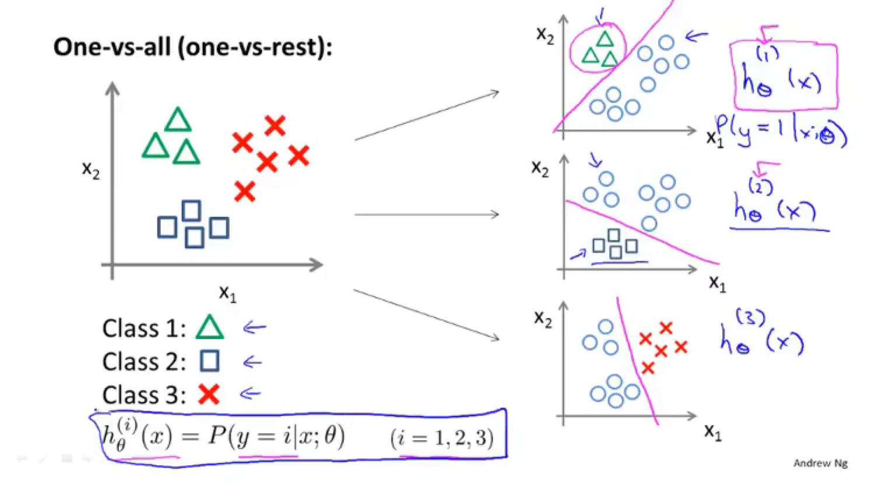
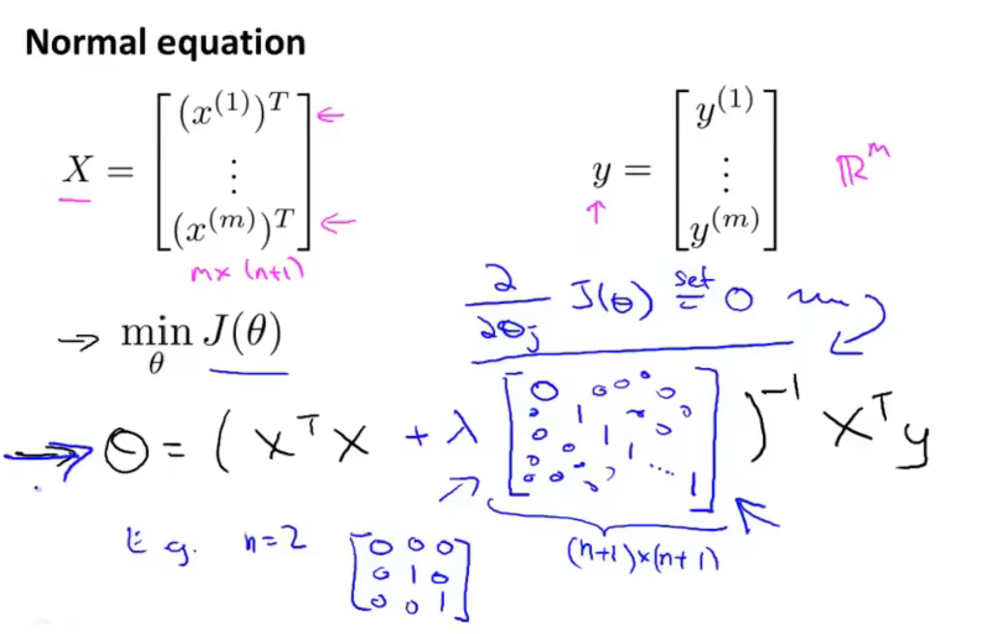

[TOC]

# 机器学习（[笔记](https://sanzo.top/Default/ml-AndrewNg/)，[作业](https://www.cnblogs.com/maxiaodoubao/p/10184428.html)）

## 机器学习分类

- 监督学习

- 无监督学习

## 函数模型

### 1、代价函数

**Hypothesis**(假设):	$h_\theta(x)=\theta_0+\theta_1x$

**Parameters**:	$\theta_0,\theta_1$

**Cost Function**:	$J(\theta_0,\theta_1)=\frac{1}{2m}\sum_{i=1}^{m}(h_\theta(x^{(i)})-y^{(i)})^2$

**Goal**:	$minimize_{\theta_0,\theta_0} J(\theta_0,\theta_1)$

### 2、梯度下降(Gradient descent)

repeat until convergence{
$$
\theta_j:=\theta_j-\alpha\frac{\partial}{\partial\theta_j}J(\theta_0,\theta_1)
\quad \quad (for\quad j=0\quad and\quad j=1)
$$
}

**Simultaneous update:**

$temp0:=\theta_0-\alpha\frac{\partial}{\partial\theta_0}J(\theta_0,\theta_1)$

$temp1:=\theta_1-\alpha\frac{\partial}{\partial\theta_1}J(\theta_0,\theta_1)$

$\theta_0:=temp0$

$\theta_1:=temp1$

### 3、线性回归（linear regression）

**Linear Regression Model**
$$
h_\theta(x)=\theta_0+\theta_1x
$$

$$
J(\theta_0,\theta_1)=\frac{1}{2m}\sum_{i=1}^{m}(h_\theta(x^{(i)})-y^{(i)})^2
$$

**Gradient descent algorithm**

repeat until convergence{
$$
\theta_0:=\theta_0-\alpha\frac{1}{m}\sum_{i=1}^m(h_\theta(x^{(i)}-y^{(i)}))
$$

$$
\theta_1:=\theta_1-\alpha\frac{1}{m}\sum_{i=1}^m(h_\theta(x^{(i)}-y^{(i)}))\cdot x^{(i)}
$$

( update $\theta_0$ and $\theta_1$ simultaneously )

}  

### 4、多元梯度下降法

- 特征缩放
- 学习率

### 5、特征和多项式回归

## 分类问题

### 1、代价函数和梯度下降

逻辑回归（logistic regression）

**梯度下降**
$$
J(\theta) = -\frac{1}{m}[\sum_{i=1}^{m}y^{(i)}\log h_\theta(x^{(i)})+(1-y^{(i)})\log(1-h_\theta(x^{(i)}))]
$$
最小化 $J(\theta)$:

重复：{
$$
\theta_j :=\theta_j-\alpha\sum_{i=1}^m(h_\theta(x^{(i)})-y^{(i)})x_j^{(i)}
$$
}	其中$h_\theta(x)=\frac{1}{1+e^{-\theta^Tx}}$

### 2、多元分类

 

## 正则化（regularization）

### 1、过度拟合（over-fitting）

### 2、线性回归：

$$
J(\theta)=\frac{1}{2m}[\sum_{i=1}^{m}(h_\theta(x^{(x)})-y^{(i)})^2+\lambda\sum_{j=1}^{n}\theta^2_{j}]
$$
min $J(\theta)$

重复{
$$
\theta_0:=\theta_0-\alpha\frac{1}{m}\sum_{i=1}^{m}(h_\theta(x^{(i)})-y^{(i)})x_0^{(i)}
$$

$$
\theta_j:=\theta_j-\alpha[\frac{1}{m}\sum_{i=1}^{m}(h_\theta(x^{(i)})-y^{(i)})x_j^{(i)}-\frac{\lambda}{m}\theta_j]
\quad (j=1,2,3,...,n)
$$

}

 

### 3、逻辑回归：

$$
J(\theta) = -\frac{1}{m}[\sum_{i=1}^{m}y^{(i)}\log h_\theta(x^{(i)})+(1-y^{(i)})\log(1-h_\theta(x^{(i)}))]+\frac{\lambda}{2m}\sum_{j=1}^n\theta_j^2
$$

 min $J(\theta)$

重复{
$$
\theta_0:=\theta_0-\alpha\frac{1}{m}\sum_{i=1}^{m}(h_\theta(x^{(i)})-y^{(i)})x_0^{(i)}
$$

$$
\theta_j:=\theta_j-\alpha[\frac{1}{m}\sum_{i=1}^{m}(h_\theta(x^{(i)})-y^{(i)})x_j^{(i)}+\frac{\lambda}{m}\theta_j]
\quad (j=1,2,3,...,n)
$$

}	其中$h_\theta(x)=\frac{1}{1+e^{-\theta^Tx}}$ 

  ## 评估假设

### 1、训练集，测试集，验证集

### 2、高偏差（bias）（欠拟合）

### 3、高方差（variance）（过拟合）

### 4、学习曲线

### 5、误差分析

### 6、不对称分类的误差评估（偏斜类）

- 查准率（precision）：预测为真的值中真正为真的值所占比例

- 查全率（recall）: 真正为真的值中有多少被预测出来了
